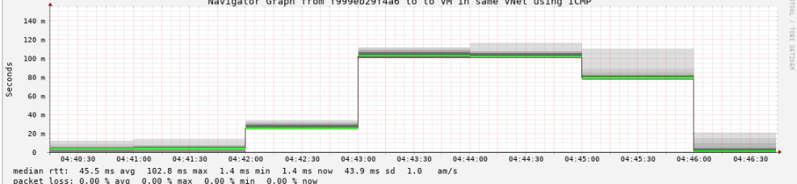

# tc

## Wipe out all rules

```bash
tc qdisc del dev eth0 root
```

## Show config

```bash
tc qdisc show dev eth0
```

## Latency

### Use Case 1: Delay 100ms

```bash
tc qdisc add dev eth0 root delay 100ms
```

```bash
#Before
root@vm-core-taiwannorth:~# ping 8.8.8.8 -c 4
PING 8.8.8.8 (8.8.8.8) 56(84) bytes of data.
64 bytes from 8.8.8.8: icmp_seq=1 ttl=54 time=33.5 ms
64 bytes from 8.8.8.8: icmp_seq=2 ttl=54 time=30.3 ms
64 bytes from 8.8.8.8: icmp_seq=3 ttl=54 time=30.2 ms
64 bytes from 8.8.8.8: icmp_seq=4 ttl=54 time=31.0 ms

--- 8.8.8.8 ping statistics ---
4 packets transmitted, 4 received, 0% packet loss, time 3000ms
rtt min/avg/max/mdev = 30.155/31.228/33.528/1.363 ms

#After
root@vm-core-taiwannorth:~# tc qdisc add dev eth0 root netem delay 100ms
root@vm-core-taiwannorth:~# ping 8.8.8.8 -c 4
PING 8.8.8.8 (8.8.8.8) 56(84) bytes of data.
64 bytes from 8.8.8.8: icmp_seq=1 ttl=54 time=130 ms
64 bytes from 8.8.8.8: icmp_seq=2 ttl=54 time=130 ms
64 bytes from 8.8.8.8: icmp_seq=3 ttl=54 time=136 ms
64 bytes from 8.8.8.8: icmp_seq=4 ttl=54 time=130 ms

--- 8.8.8.8 ping statistics ---
4 packets transmitted, 4 received, 0% packet loss, time 3003ms
rtt min/avg/max/mdev = 130.136/131.612/135.942/2.500 ms

# Clean
root@vm-core-taiwannorth:~# tc qdisc del dev eth0 root
root@vm-core-taiwannorth:~# ping 8.8.8.8 -c 4
PING 8.8.8.8 (8.8.8.8) 56(84) bytes of data.
64 bytes from 8.8.8.8: icmp_seq=1 ttl=54 time=30.1 ms
64 bytes from 8.8.8.8: icmp_seq=2 ttl=54 time=30.1 ms
64 bytes from 8.8.8.8: icmp_seq=3 ttl=54 time=35.0 ms
64 bytes from 8.8.8.8: icmp_seq=4 ttl=54 time=30.2 ms

--- 8.8.8.8 ping statistics ---
4 packets transmitted, 4 received, 0% packet loss, time 3004ms
rtt min/avg/max/mdev = 30.096/31.351/35.044/2.132 ms
```




### Use Case 2: Delay 100ms +- 10ms

```bash
tc qdisc add dev eth0 root delay 100ms 10ms
```

### Use Case 3: Delay 100ms +- 10ms 10% correlation

```bash
tc qdisc add dev eth0 root delay 100ms 10ms 10%
```

## Loss Rate

### Use Case 1: Loss 0.1%

```bash
tc qdisc add dev eth0 root netem loss 0.1%
```

### Use Case 2: Loss 0.1% 10% correlation

```bash
tc qdisc add dev eth0 root netem loss 0.1% 10%
```

## Duplicate

### Use Case 1: Duplicate 1%

```bash
tc qdisc add dev eth0 root netem duplicate 1%
```

### Use Case 2: Duplicate 0.1% corrupt packets

```bash
tc qdisc add dev eth0 root netem corrupt 0.1%
```
